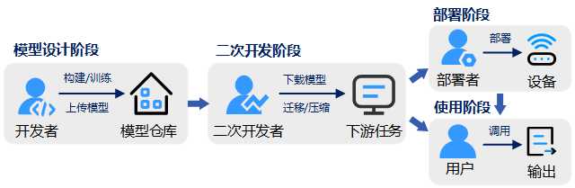

# 深度学习模型供应链的安全性研究综述
这个 Github 存储库总结了深度学习模型供应链相关的资源。 有关更多详细信息和分类标准，请参阅我们的综述论文。

预训练模型解决了训练数据和算力受限的问题，已在各领域被广泛使用，它也催生了模型开发和应用的新范式——深度学习模型供应链。

模型经过设计和训练，由发布者上传至预训练模型仓库，由二次开发者进行迁移和压缩，部署到边缘端设备，并提供给用户使用。模型供应链引入了新环节和多要素，带来数据泄露风险和计算安全问题。

我们调研了相关的研究工作，根据模型生命周期的阶段，对模型设计、二次开发、部署和使用阶段的攻击和防御进行梳理和总结。
## 模型设计阶段的攻击
### 下游任务相关的攻击

1. Weight Poisoning Attacks on Pretrained Models. ACL 2020. [\[pdf\]](https://aclanthology.org/2020.acl-main.249/)  [\[code\]](https://github.com/neulab/RIPPLe)

2. Backdoor Attacks on Pre-trained Models by Layerwise Weight Poisoning. EMNLP 2021. [\[pdf\]](https://aclanthology.org/2021.emnlp-main.241/)

3. Trojaning language models for fun and profit. IEEE EuroS&P 2021. [\[pdf\]](https://ieeexplore.ieee.org/abstract/document/9581257/)  [\[code\]](https://github.com/alps-lab/trojan-lm)

4. Badprompt: Backdoor attacks on continuous prompts. NeurIPS 2022. [\[pdf\]](https://proceedings.neurips.cc/paper_files/paper/2022/hash/f0722b58f02d7793acf7d328928f933a-Abstract-Conference.html)   [\[code\]](https://github.com/papersPapers/BadPrompt)

5. Badencoder: Backdoor attacks to pre-trained encoders in self-supervised learning. SP 2022.  [\[pdf\]](https://ieeexplore.ieee.org/abstract/document/9833644/)   [\[code\]](https://github.com/jinyuan-jia/BadEncoder)

6. PoisonedEncoder: Poisoning the Unlabeled Pre-training Data in Contrastive Learning. USENIX 2022. [\[pdf\]](https://www.usenix.org/conference/usenixsecurity22/presentation/liu-hongbin) 

7. CorruptEncoder: Data Poisoning based Backdoor Attacks to Contrastive Learning. arXiv 2022. [\[pdf\]](https://arxiv.org/abs/2211.08229) 

### 下游任务无关的攻击

1. Model-reuse attacks on deep learning systems. CCS 2018. [\[pdf\]](https://dl.acm.org/doi/abs/10.1145/3243734.3243757)

2. Badpre: Task-agnostic backdoor attacks to pre-trained nlp foundation models. arXiv 2021.  [\[pdf\]](https://arxiv.org/abs/2110.02467)   [\[code\]](https://github.com/kangjie-chen/BadPre)

3. Red alarm for pre-trained models: Universal vulnerability to neuron-level backdoor attacks. Machine Intelligence Research 2023.  [\[pdf\]](https://link.springer.com/article/10.1007/s11633-022-1377-5)   [\[code\]](https://github.com/thunlp/NeuBA)

4. Backdoor Pre-trained Models Can Transfer to All. CCS 2021.  [\[pdf\]](https://dl.acm.org/doi/abs/10.1145/3460120.3485370)

5. A Data-free Backdoor Injection Approach in Neural Networks. USENIX 2023.  [\[pdf\]](https://www.usenix.org/system/files/sec23fall-prepub-573-lv.pdf)   [\[code\]](https://github.com/lvpeizhuo/Data-free_Backdoor)

6. NOTABLE: Transferable Backdoor Attacks Against Prompt-based NLP Models. arXiv 2023.  [\[pdf\]](https://arxiv.org/abs/2305.17826)   [\[code\]](https://github.com/RU-System-Software-and-Security/Notable)

7. UOR: Universal Backdoor Attacks on Pre-trained Language Models. arXiv 2023.  [\[pdf\]](https://arxiv.org/abs/2305.09574)

8. Training-free Lexical Backdoor Attacks on Language Models. WWW 2023.  [\[pdf\]](https://dl.acm.org/doi/abs/10.1145/3543507.3583348)   [\[code\]](https://github.com/Jinxhy/TFLexAttack)

9. Multi-target Backdoor Attacks for Code Pre-trained Models. arXiv 2023.  [\[pdf\]](https://arxiv.org/abs/2306.08350)

## 二次开发阶段的攻击
### 针对迁移的攻击

1. With great training comes great vulnerability: Practical attacks against transfer learning. USENIX 2018. [\[pdf\]](https://www.usenix.org/conference/usenixsecurity18/presentation/wang-bolun)

2. Latent backdoor attacks on deep neural networks. CCS 2019.  [\[pdf\]](https://dl.acm.org/doi/abs/10.1145/3319535.3354209)   [\[code\]](https://github.com/Huiying-Li/Latent-Backdoor)

3. Backdoor attacks against transfer learning with pre-trained deep learning models. IEEE Transactions on Services Computing 2020. [\[pdf\]](https://ieeexplore.ieee.org/abstract/document/9112322/)

4. Incremental Learning, Incremental Backdoor Threats. IEEE Transactions on Dependable and Secure Computing 2022. [\[pdf\]](https://ieeexplore.ieee.org/abstract/document/9872528/)

5. Pre-trained Adversarial Perturbations. NeurIPS 2022. [\[pdf\]](https://proceedings.neurips.cc/paper_files/paper/2022/hash/084727e8abf90a8365b940036329cb6f-Abstract-Conference.html)

6. Ppt: Backdoor attacks on pre-trained models via poisoned prompt tuning. IJCAI 2022. [\[pdf\]](https://www.ijcai.org/proceedings/2022/0096.pdf)

7. Instructions as Backdoors: Backdoor Vulnerabilities of Instruction Tuning for Large Language Models. arXiv 2023.  [\[pdf\]](https://arxiv.org/abs/2305.14710)

8. Teacher model fingerprinting attacks against transfer learning. USENIX 2022. [\[pdf\]](https://www.usenix.org/conference/usenixsecurity22/presentation/chen-yufei)

9. Manipulating Transfer Learning for Property Inference. CVPR 2023.  [\[pdf\]](http://openaccess.thecvf.com/content/CVPR2023/html/Tian_Manipulating_Transfer_Learning_for_Property_Inference_CVPR_2023_paper.html)   [\[code\]](https://github.com/yulongt23/Transfer-Inference)

10. Information leakage in embedding models. CCS 2020. [\[pdf\]](https://dl.acm.org/doi/abs/10.1145/3372297.3417270)
 
11. Extracting training data from large language models. USENIX 2021. [\[pdf\]](https://www.usenix.org/conference/usenixsecurity21/presentation/carlini-extracting)

12. EncoderMI: Membership inference against pre-trained encoders in contrastive learning. CCS 2021. [\[pdf\]](https://dl.acm.org/doi/abs/10.1145/3460120.3484749)

13. StolenEncoder: stealing pre-trained encoders in self-supervised learning. CCS 2022. [\[pdf\]](https://dl.acm.org/doi/abs/10.1145/3548606.3560586)

14. Can't Steal? Cont-Steal! Contrastive Stealing Attacks Against Image Encoders. CVPR 2023. [\[pdf\]](https://openaccess.thecvf.com/content/CVPR2023/html/Sha_Cant_Steal_Cont-Steal_Contrastive_Stealing_Attacks_Against_Image_Encoders_CVPR_2023_paper.html)

### 针对压缩的攻击
1. Qu-anti-zation: Exploiting quantization artifacts for achieving adversarial outcomes. NeurIPS 2021.  [\[pdf\]](https://proceedings.neurips.cc/paper_files/paper/2021/hash/4d8bd3f7351f4fee76ba17594f070ddd-Abstract.html)  [\[code\]](https://github.com/Secure-AI-Systems-Group/Qu-ANTI-zation)

2. Quantization backdoors to deep learning commercial frameworks. IEEE Transactions on Dependable and Secure Computing 2023.  [\[pdf\]](https://ieeexplore.ieee.org/abstract/document/10113762/)   [\[code\]](https://github.com/quantization-backdoor)

3. Stealthy backdoors as compression artifacts. IEEE Transactions on Information Forensics and Security 2022.  [\[pdf\]](https://ieeexplore.ieee.org/abstract/document/9737144/)   [\[code\]](https://github.com/yulongtzzz/Stealthy-Backdoors-as-Compression-Artifacts)

4. RIBAC: Towards R obust and I mperceptible B ackdoor A ttack against C ompact DNN. ECCV 2022.  [\[pdf\]](https://link.springer.com/chapter/10.1007/978-3-031-19772-7_41)   [\[code\]](https://github.com/huyvnphan/ECCV2022-RIBAC)

5. Anti-distillation backdoor attacks: Backdoors can really survive in knowledge distillation. ACM Multimedia 2021. [\[pdf\]](https://dl.acm.org/doi/abs/10.1145/3474085.3475254)

## 部署阶段的攻击
1. Towards practical deployment-stage backdoor attack on deep neural networks. CVPR 2022.  [\[pdf\]](http://openaccess.thecvf.com/content/CVPR2022/html/Qi_Towards_Practical_Deployment-Stage_Backdoor_Attack_on_Deep_Neural_Networks_CVPR_2022_paper.html)  [\[code\]](https://github.com/Unispac/Subnet-Replacement-Attack)

## 使用阶段的攻击
1. Analyzing information leakage of updates to natural language models. CCS 2020.  [\[pdf\]](https://dl.acm.org/doi/abs/10.1145/3372297.3417880) 

2. Dataset reconstruction attack against language models. CEUR Workshop 2021. [\[pdf\]](https://ceur-ws.org/Vol-2942/paper1.pdf)

3. Analyzing Leakage of Personally Identifiable Information in Language Models. IEEE SP 2023. [\[pdf\]](https://www.computer.org/csdl/proceedings-article/sp/2023/933600a346/1NrbXJj80H6)

4. The thieves on sesame street are polyglots-extracting multilingual models from monolingual APIs. EMNLP 2020. [\[pdf\]](https://aclanthology.org/2020.emnlp-main.501/)

5. Student Surpasses Teacher: Imitation Attack for Black-Box NLP APIs. COLING 2022.  [\[pdf\]](https://aclanthology.org/2022.coling-1.251/)

6. On the feasibility of specialized ability stealing for large language code models. arXiv 2023. [\[pdf\]](https://arxiv.org/abs/2303.03012) 

## 供应链中的安全防护方法

### 设计阶段的防护
1. Detecting Backdoors in Pre-trained Encoders. CVPR 2023. [\[pdf\]](https://openaccess.thecvf.com/content/CVPR2023/html/Feng_Detecting_Backdoors_in_Pre-Trained_Encoders_CVPR_2023_paper.html)    [\[code\]](https://github.com/GiantSeaweed/DECREE)

2. Moderate-fitting as a Natural Backdoor Defender for Pre-trained Language Models. NeurIPS 2022. [\[pdf\]](https://proceedings.neurips.cc/paper_files/paper/2022/hash/0799492e7be38b66d10ead5e8809616d-Abstract-Conference.html)    

3. Purifier: Plug-and-play Backdoor Mitigation for Pre-trained Models Via Anomaly Activation Suppression. ACM Multimedia 2022. [\[pdf\]](https://dl.acm.org/doi/abs/10.1145/3503161.3548065)    [\[code\]](https://github.com/RUIYUN-ML/Purifier)

4. Poison forensics: Traceback of data poisoning attacks in neural networks. USENIX 2022. [\[pdf\]](https://www.usenix.org/conference/usenixsecurity22/presentation/shan) 

5. BEAGLE: Forensics of Deep Learning Backdoor Attack for Better Defense. NDSS 2023.  [\[pdf\]](https://www.ndss-symposium.org/wp-content/uploads/2023-944-paper.pdf)    [\[code\]](https://github.com/Megum1/BEAGLE)

### 二次开发阶段的防护
1. How should pre-trained language models be fine-tuned towards adversarial robustness? NeurIPS 2021.  [\[pdf\]](https://proceedings.neurips.cc/paper/2021/hash/22b1f2e0983160db6f7bb9f62f4dbb39-Abstract.html)     [\[code\]](https://github.com/dongxinshuai/RIFT-NeurIPS2021)

2. ROSE: Robust Selective Fine-tuning for Pre-trained Language Models. EMNLP 2022.  [\[pdf\]](https://aclanthology.org/2022.emnlp-main.186/)    [\[code\]](https://github.com/jiangllan/ROSE)

3. Fine-mixing: Mitigating Backdoors in Fine-tuned Language Models. EMNLP 2022.  [\[pdf\]](https://aclanthology.org/2022.findings-emnlp.26/)

4. Diffusion Theory as a Scalpel: Detecting and Purifying Poisonous Dimensions in Pre-trained Language Models Caused by Backdoor or Bias. arXiv 2023.  [\[pdf\]](https://arxiv.org/abs/2305.04547)

5. ReMoS: reducing defect inheritance in transfer learning via relevant model slicing. ICSE 2022.  [\[pdf\]](https://dl.acm.org/doi/abs/10.1145/3510003.3510191)

6. Analysis of Failures and Risks in Deep Learning Model Converters: A Case Study in the ONNX Ecosystem. arXiv 2023.  [\[pdf\]](https://arxiv.org/abs/2303.17708)

7. Safety and Performance, Why not Both? Bi-Objective Optimized Model Compression toward AI Software Deployment. ASE 2022.  [\[pdf\]](https://dl.acm.org/doi/abs/10.1145/3551349.3556906)    [\[code\]](https://github.com/JiePKU/MIA-SafeCompress)
 
8. Finding Deviated Behaviors of the Compressed DNN Models for Image Classifications. ACM TOSEM 2021.  [\[pdf\]](https://dl.acm.org/doi/abs/10.1145/3583564)    [\[code\]](https://github.com/yqtianust/DFlare)

### 部署阶段的防护
1. Metamorphic testing of deep learning compilers. Proceedings of the ACM on Measurement and Analysis of Computing Systems 2022. [\[pdf\]](https://dl.acm.org/doi/abs/10.1145/3508035)

2. Nnsmith: Generating diverse and valid test cases for deep learning compilers. ASPLOS 2023. [\[pdf\]](https://dl.acm.org/doi/abs/10.1145/3575693.3575707)

3. Fuzzing Deep Learning Compilers with HirGen. ISSTA 2023. [\[pdf\]](https://dl.acm.org/doi/abs/10.1145/3597926.3598053)

### 使用阶段的防护
1. TextFusion: Privacy-Preserving Pre-trained Model Inference via Token Fusion. EMNLP 2022. [\[pdf\]](https://aclanthology.org/2022.emnlp-main.572/)

2. TextObfuscator: Making Pre-trained Language Model a Privacy Protector via Obfuscating Word Representations. ACL 2023.  [\[pdf\]](https://aclanthology.org/2023.findings-acl.337/)

